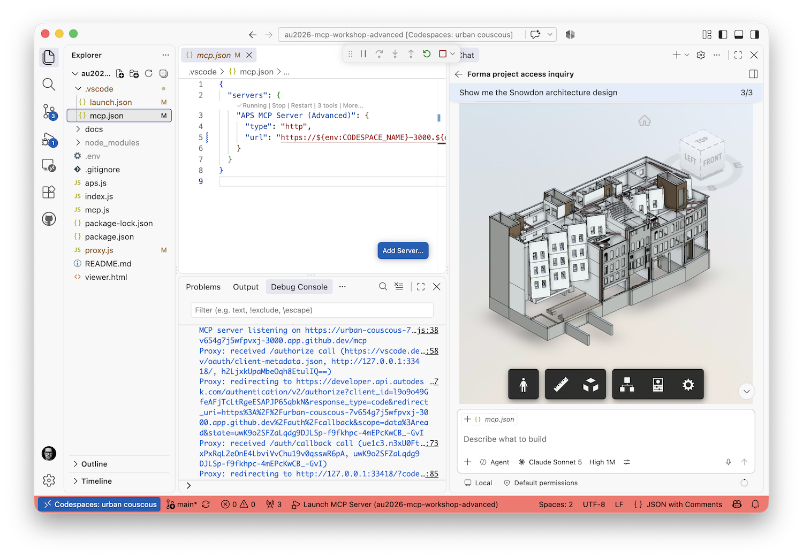

# AU2026 MCP Workshop: Advanced

Welcome to the advanced session of the **Autodesk Platform Services MCP Workshop** at Autodesk University 2026.

## What you'll build

Starting from the small MCP server the [beginner session](https://github.com/autodesk-platform-services/au2026-mcp-workshop-beginner) produces, you'll turn it into a networked server that acts on behalf of a signed-in Autodesk user and renders 3D previews in chat:

- Replace the local **STDIO** transport with **Streamable HTTP** over Express, and run it from a GitHub Codespace with a public URL.
- Swap **2-legged** application authentication for **3-legged** user OAuth, and put an OAuth proxy of your own in front of `/mcp` so an MCP client has to sign in — with the same Autodesk account — before it can call a single tool.
- Add a `preview-design` MCP tool that returns an embedded **APS Viewer** panel, letting the AI show designs in 3D and read back what the user selects.

